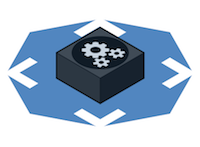
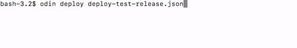
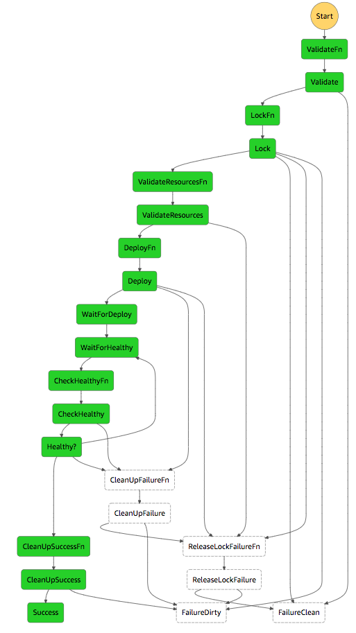

# Odin Auto-Scaling Group Deployer



Deploy your [12-factor-applications](https://12factor.net/) to AWS easily and securely with the Odin. Odin is a AWS [Step Function](https://docs.aws.amazon.com/step-functions/latest/dg/welcome.html) base on the [`step`](https://github.com/coinbase/step) framework that deploys services as [Auto-Scaling Groups](https://docs.aws.amazon.com/autoscaling/ec2/userguide/what-is-amazon-ec2-auto-scaling.html) (ASG's) to AWS.

Odin's goals/requirements/features are:

1. **Ephemeral Blue/Green**: create new instances, wait for them to become healthy, delete old instances; treating compute instances as disposable and ephemeral.
1. **Declarative**: describe what a successful release looks like, not how to deploy it.
1. **Scalable**: can scale both vertically (larger instances) and horizontally (more instances).
1. **Secure**: resources are verified to ensure that they cannot be used accidentally or maliciously.
1. **Gracefully Fail**: handle failures to recover and roll back with no/minimal impact to users.
1. **Configuration Parity**: minimize divergence between production, staging and development environments by keeping releases as similar as possible.
1. **No Configuration**: once Odin is deployed it requires no further configuration.
1. **Multi Account**: one deployer for all AWS accounts.

### Getting Started

Odin is implemented as an [AWS Lambda Function](https://docs.aws.amazon.com/lambda/latest/dg/welcome.html) and [AWS Step Function](https://docs.aws.amazon.com/step-functions/latest/dg/welcome.html) that deploys by assuming a role into an AWS account. You can bootstrap these into AWS with:

```bash
git pull # pull down new code
./scripts/bootstrap
```

#### Testing with deploy-test

Odin includes a test project `deploy-test` that has one service `web` that starts an nginx server to be mounted behind a [Elastic Load Balancer](https://aws.amazon.com/elasticloadbalancing/) (ELB) and [Application Load Balancer](https://docs.aws.amazon.com/elasticloadbalancing/latest/application/introduction.html) target group. The service instances have a [security group](https://docs.aws.amazon.com/AWSEC2/latest/UserGuide/using-network-security.html) and [instance profile](https://docs.aws.amazon.com/IAM/latest/UserGuide/id_roles_use_switch-role-ec2_instance-profiles.html).

To create the AWS resources for `deploy-test`:

```bash
./scripts/geo apply resources/deploy-test-resources.rb
```

*Note: you will also have to tag the latest Ubuntu release with `Name: ubuntu` and `DeployWith: odin`*

A `deploy-test` release file `deployer-test-release.json` looks like:

```yaml
{
  "project_name": "coinbase/deploy-test",
  "config_name": "development",
  "subnets": ["test_private_subnet_a", "test_private_subnet_b"],
  "ami": "ubuntu",
  "user_data": "{{USER_DATA_FILE}}",
  "services": {
    "web": {
      "instance_type": "t2.nano",
      "security_groups": ["ec2::coinbase/deploy-test::development"],
      "elbs": ["coinbase-deploy-test-web-elb"],
      "profile": "coinbase-deploy-test",
      "target_groups": ["coinbase-deploy-test-web-tg"]
    }
  }
}
```

The user data `{{USER_DATA_FILE}}` is replaced with the contents of the file `deployer-test-release.json.userdata`:

```yaml
#cloud-config
repo_update: true
repo_upgrade: all

packages:
 - docker.io

runcmd:
 - docker run -d -p 8000:80 nginx
```

To build a release for `deploy-test` and send it to Odin we use the `odin` executable:

```bash
odin deploy deploy-test-release.json
```



The `odin` executable takes the release file, merges in the user data, attaches some meta-data like `created_at` and `release_id, then send the release to the Odin step function that:

1. validates the sent release and any referenced resources.
1. creates a new auto-scaling group for `web` that starts an nginx server.
1. waits for the EC2 instances in the `web` ASG to become healthy w.r.t. the ASG, the ELB and the target group. This may take a few minutes.
1. Once healthy the ASGs from the previous release and terminate their instances.

This is the **ephemeral blue/green** where old instances are deleted and new servers created.

### Odin Release

An Odin release is a request to deploy a **Project-Configuration** where:

* A **Project** is a code-base typically named with `org/name`.
* A **Configuration** is the environment the project is being deployed into, e.g. `development`, `production`.

Each release can define 1-to-many **Services**; each service is a logical group of servers, e.g. `web` or `worker`, that maps to a single auto-scaling group (ASG).

When Odin is sent a release, it moves it through a state machine:



1. **Validate**: validate the release is correct.
1. **Lock**: grabs a lock on project-configuration.
1. **ValidateResources**: validate resources w.r.t. the project, configuration and service using them.
1. **Deploy**: creates an ASG and other resource for each service.
1. **CheckHealthy**: check to see if the new instances created are healthy w.r.t. their ASGs ELBs and target groups. If instances are seen to be terminating immediately halt release.
1. **CleanUpSuccess**: if the release was a success, then delete the old ASGs.
1. **CleanUpFailure**: if the release failed, delete the new ASGs.
1. **ReleaseLockFailure**: try to release the lock and fail.

At each of these states it is possible to fail and then move towards a failure state. The typical failures are:

* **BadReleaseError**: The release sent was invalid because either its structure was incorrect, its values were invalid, or its resources were invalid.
* **LockExistsError**: Could not grab the lock because either another deploy for the project-configuration is currently going out, or a previous deploy left a lock in place.
* **DeployError**: Unable to create a new ASG or resource.
* **HaltError**: Halt was detected or instances were found terminating.
* **TimeoutError**: The deploy took too long and failed.

The end states are:

1. **Success**: the release went went as planned.
2. **FailureClean**: release was unsuccessful, but cleanup was successful, so AWS was left in good state.
3. **FailureDirty**: release was unsuccessful, but cleanup failed so AWS was left in a bad state. This should never happen and should alert if this happens, and file a bug.
4. It is possible to not end in one of these states if the state machine is incorrect. **This is very bad**, alert if this happens and file a bug.

#### Resources

A release uses resources that must exist and be configured correctly to be used for the project-configuration-service being deployed.

A release **must** have:

1. an **AMI** defined with the `ami` key that can be either a `Name` tag or AMI ID e.g. `ami-1234567`
2. **Subnets** defined with `subnets` key that is a list of either `Name` tags or Subnet IDs e.g. `subnet-1234567`

Both the above resources **MUST** have a tag `DeployWith` that equals `odin`.

Services **can** have:

1. **Security Groups** defined with `security_groups` key is a list of security groups `Name` tags
2. **Elastic Load Balancers** defined with `elbs` key is a list of ELB names
3. **Application Load Balancer Target Groups** defined with `target_groups` is a list of target group's `Name` tags

All the above resources **MUST** be tagged with the `ProjectName`, `ConfigName` and `ServiceName` of the release to ensure that resources are assigned correctly.

Services can also have an **Instance Profile** defined by the `profile` key that is and instance profile `Name` tag. The roles path **MUST** be equal to `/<project_name>/<config_name>/<service_name>/`.

#### Scale

Odin makes it easy to scale both vertically and horizontally. To scale `deploy-test` we add to the release:

```yaml
{ ...
  "services": {
    "web": { ...
      "instance_type": "c4.xlarge",
      "ebs_volume_size": 20,
      "ebs_volume_type": "gp2",
      "ebs_device_name": "/dev/sda1",
      "autoscaling": {
        "min_size": 3,
        "max_size": 5,
        "spread": 0.2,
        "max_terms": 1,
        "policies": [
          {
            "type": "cpu_scale_up",
            "threshold" : 25,
            "scaling_adjustment": 2
          },
          {
            "type": "cpu_scale_down",
            "threshold" : 15,
            "scaling_adjustment": -1
          }
        ]
      }
    }
  }
}
```

* `instance_type` is the [EC2 instance type](https://www.ec2instances.info/) for the service
* `ebs_volume_size`, `ebs_volume_type`, `ebs_device_name` define the attached [EBS volume](https://aws.amazon.com/ebs/) in GB.

The `autoscaling` key defines the horizontal scaling of a service:

* all calculations are bounded by `min_size` and `max_size`.
* the `desired_capacity` is equal to the `min_size` or capacity of the previously launched service
* the actual number of instances launched is the `desired_capacity * (1 + spread)`
* to be deemed the healthy the service must have `desired_capacity * (1 - spread)`
* if the number of terminating is greater than or equal to `max_terms` (default `0`), the release is immediately halts.
* `policies` are defined above to increase the `desired_capacity` by 2 instances if the CPU goes above 25% and reduce by 1 instance if it drops below 15%.

*Both `spread` and `max_terms` are useful when launching many instances because as scale increases the number of cloud errors increase.*

#### User Data

**Do not put sensitive data into user data**. User data is not treated by Odin as secure information, it is difficult to secure with IAM, and it is very [limited in size](https://docs.aws.amazon.com/AWSEC2/latest/UserGuide/ec2-instance-metadata.html#instancedata-add-user-data). We recommend using [Vault](https://www.vaultproject.io/), [AWS Parameter store](https://docs.aws.amazon.com/systems-manager/latest/userguide/systems-manager-paramstore.html), or [KMS encrypted S3](https://docs.aws.amazon.com/kms/latest/developerguide/services-s3.html) authenticated by a service's instance profile.

The `user_data` in the release is the plain text [instance metadata](https://docs.aws.amazon.com/AWSEC2/latest/UserGuide/ec2-instance-metadata.html) sent to initialize each instance. Odin will replace some strings with information about the release, project, config and service, e.g.:

```yaml
...
write_files:
  - path: /
    content: |
      {{RELEASE_ID}}
      {{PROJECT_NAME}}
      {{CONFIG_NAME}}
      {{SERVICE_NAME}}
```

Odin will replace `{{PROJECT_NAME}}` with the name of the project and `{{SERVICE_NAME}}` with the name of the service. This can be useful for getting service specific configuration and logging.

If `user_data` is equal to `{{USER_DATA_FILE}}` and deployed with `odin` the value will be replaced with the contents of the `<release_file>.userdata`, e.g. `deployer-test-release.json.userdata`.

#### Timeout

A release can have a `timeout` which is how long in seconds a release will wait for its services to become healthy. By default the timeout is 10 minutes, the max value would be around a year (*31556926 seconds*) since that is how long a step function can run.

#### Lifecycle

AWS provides [Auto Scaling Group Lifecycle Hooks](https://docs.aws.amazon.com/autoscaling/ec2/userguide/lifecycle-hooks.html) to detect and react to auto-scaling events. You can add the lifecycle hooks to the ASGs with:

```yaml
{ ...
  "lifecycle": {
    "termhook" : {
      "transition": "autoscaling:EC2_INSTANCE_TERMINATING",
      "role": "asg_lifecycle_hooks",
      "sns": "asg_lifecycle_hooks",
      "heartbeat_timeout": 300
    }
  }
}
```

These can be used to gracefully shutdown instances, which is necessary if a service has long running jobs e.g. a `worker` service.

#### Halt

Odin supports manually stopping a release while is it being deployed. Just execute:

```
odin halt deploy-test-release.json
```

This will:

1. Find the running deploy for the project configuration
2. Write a `halt` file to S3
3. Wait for Odin to detect the halt file and fail the deploy

Halt does not guarantee that the release will not be deployed, if executed too late the release may still result in success.

**DO NOT** use `Stop execution` of the Odin step function as it will not clean up resources and leave AWS in a bad state.

### Security

Deployers are critical pieces of infrastructure as they may be used to compromise software they deploy. As such, we take security very seriously around the `odin` and try to answer the following questions:

1. *Authentication*: Who can deploy?
2. *Authorization*: What can be deployed?
3. *Replay* and *Man-in-the-middle (MITM)*: Can some unauthorized person edit or reuse a release to change what is deployed?
4. *Audit*: Who has done what, and when?

#### Authentication

The central authentication mechanisms are the AWS IAM permissions for step functions and S3.

By limiting the `ec2:CreateAutoscalingGroup`, permissions the Odin function becomes the only way to deploy ASG's. Then limiting permissions to who can call `states:StartExecution` for Odin limits who can deploy.

Ensuring that Odin's lambda can only access a single S3 bucket, further limits who can deploy with:

```yaml
{
  "Effect": "Allow",
  "Action": [
    "s3:GetObject*", "s3:PutObject*",
    "s3:List*", "s3:DeleteObject*"
  ],
  "Resource": [
    "arn:aws:s3:::#{s3_bucket_name}/*",
    "arn:aws:s3:::#{s3_bucket_name}"
  ]
},
{
  "Effect": "Deny",
  "Action": ["s3:*"],
  "NotResource": [
    "arn:aws:s3:::#{s3_bucket_name}/*",
    "arn:aws:s3:::#{s3_bucket_name}"
  ]
},
```

Who can execute the step function, and who can upload to S3 are the two permissions that guard who can deploy.

#### Authorization

All resources that can be used in a Odin deploy must opt-in using tags or paths. Additionally, service resources require specific tags or paths denoting which project/config/service can use them.

Assets uploaded to S3 are in the path `/<ProjectName>/<ConfigName>` so limiting who can `s3:PutObject` to a path can be used to limit what project-configs they can deploy or halt.

#### Replay and MITM

Each release the client generates a release `release_id`, a `created_at` date, and together also uploads the release to S3.

The `odin` will reject any request where the `created_at` date is not recent, or the release sent to the step function and S3 don't match. This means that if a user can invoke the step function, but not upload to S3 (or vice-versa) it is not possible to deploy old or malicious code.

#### Audit

Working out what happened and when is very useful for debugging and security response. Step functions make it easy to see the history of all executions in the AWS console and via API. S3 can log all access to cloud-trail, so collecting from these two sources will show all information about a deploy.

### Continuing Deployment

There is always more to do:

1. Allow LifeCycle Hooks to send to Cloudwatch.
1. Subnet, AMI, life cycle and userdata overrides per service.
1. Check EC2 instance limits and capacity before deploying.
1. Slowly scale instances up rather than all at once, e.g. deploy 1 instance check it is healthy then deploy the rest.
1. Add ELB and Target Group error rates when checking healthy.
1. Custom auto-scaling policy types.

